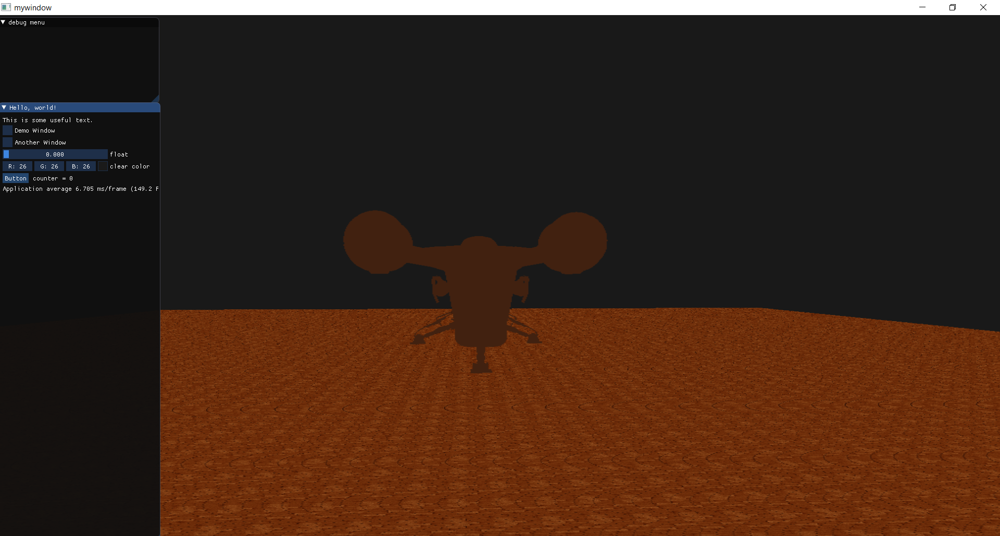
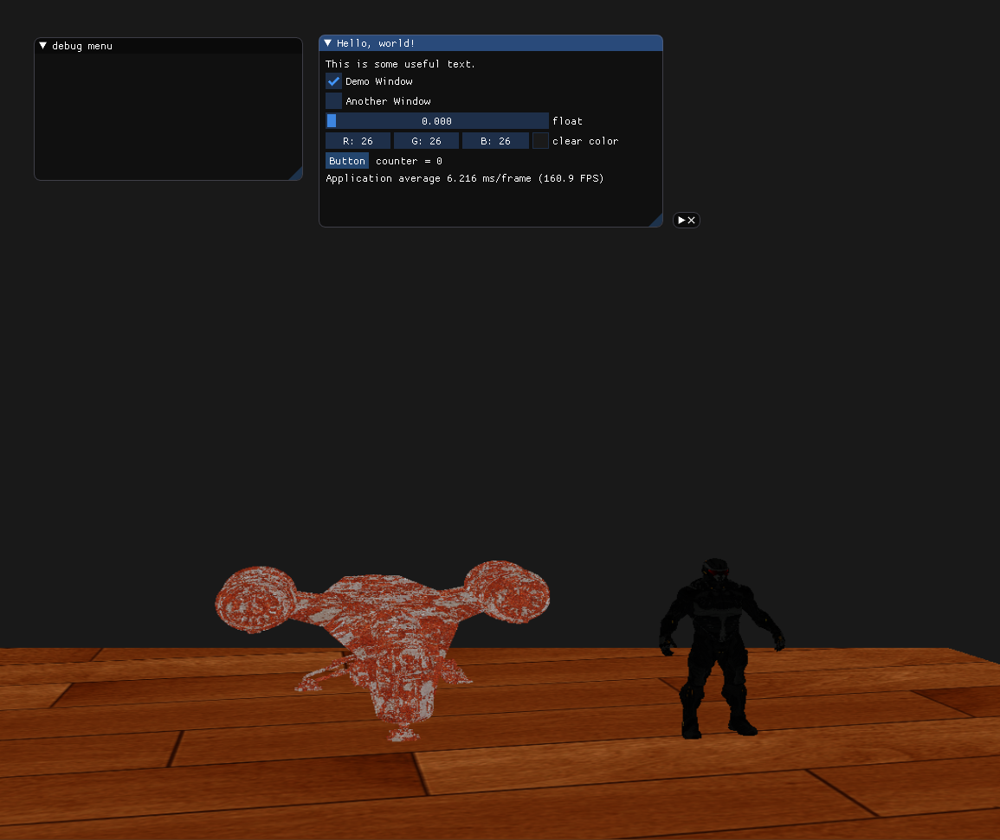

# myGameEngine:   Predator
i was making some opengl projects to cope with repetition of code i m making somewhat gameEngine 

this game engine is supposed to make small games loading model 
i m learning opengl and other concepts hoping to implement them 
it is not still that much advanced to be called a game engine but i m working on it 

model can be loaded and variable can be varied with imgui 

instancing and adding other texture is also made easier for user

